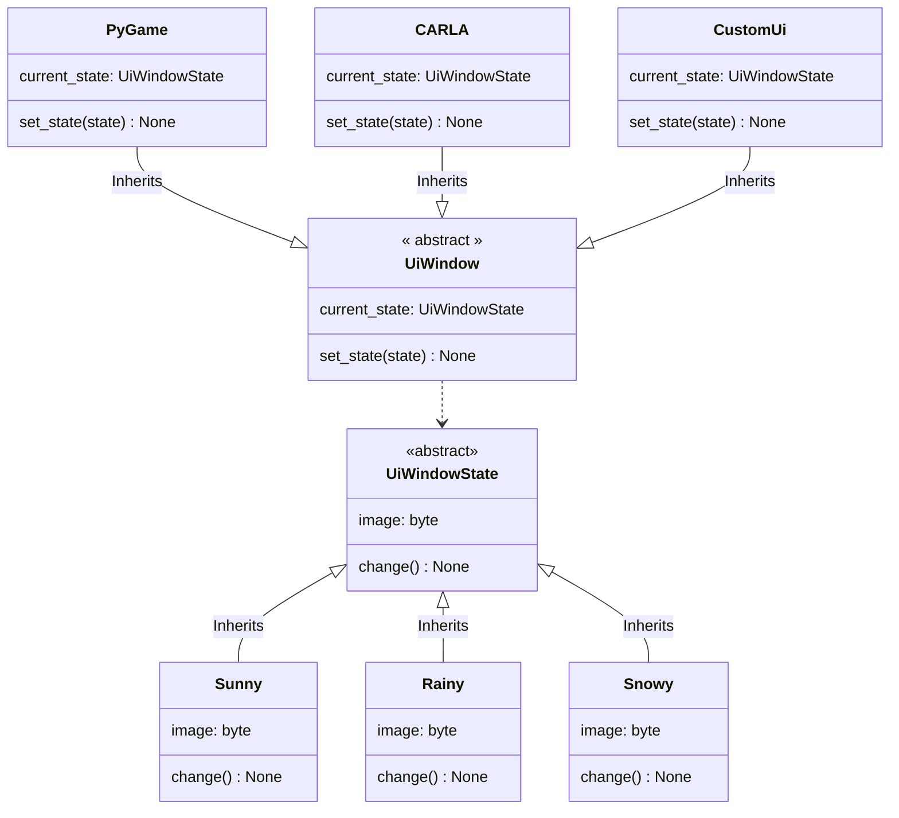

---
State design pattern to Car Simulator
---

```mermaid

classDiagram
class UiWindow{
	<< abstract >>
	current_state: UiWindowState
	set_state(state) None
}

class PyGame {
	current_state: UiWindowState
	set_state(state) None
}

class CARLA {
	current_state: UiWindowState
	set_state(state) None
}

class CustomUi {
	current_state: UiWindowState
	set_state(state) None
}


class UiWindowState {
	<<abstract>>
	image: byte
	change() None
}

class Sunny {
	image: byte
	change() None
}

class Rainy {
	image: byte
	change() None
}

class Snowy {
	image: byte
	change() None
}


PyGame --|> UiWindow: Inherits
CARLA --|> UiWindow: Inherits
CustomUi --|> UiWindow: Inherits

UiWindow ..> UiWindowState

UiWindowState <|-- Sunny: Inherits
UiWindowState <|-- Rainy: Inherits
UiWindowState <|-- Snowy: Inherits

```
