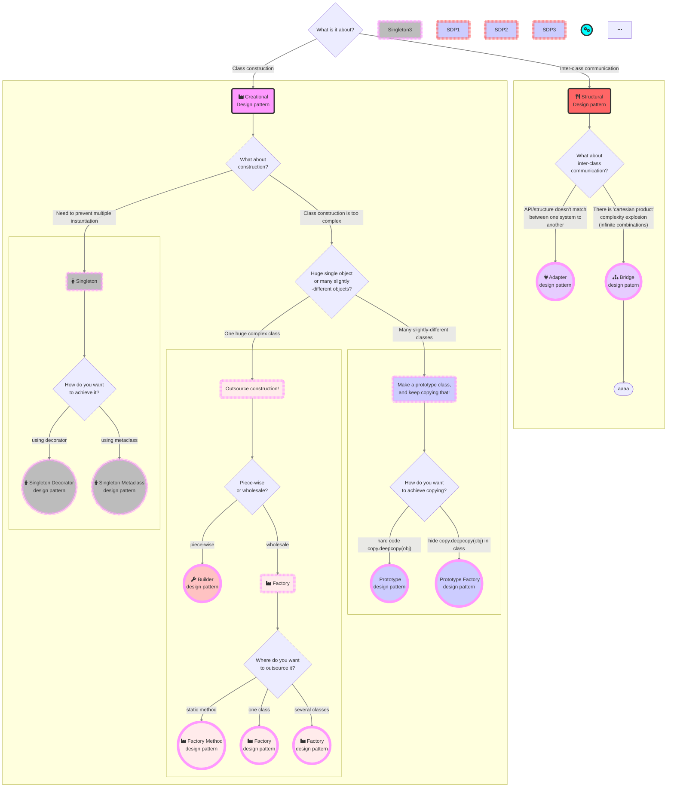

---
DIP: Same example from SRP
---

```mermaid

flowchart TB


Origin{What is it about?}

Origin -- Class construction --> Creational(fa:fa-industry Creational\nDesign pattern)
Origin -- Inter-class communication --> Structural(fa:fa-cutlery Structural\nDesign pattern)


%% --------------------------------------------------------------------

subgraph Subgraph1[ ]
    Creational --> C1{What about\n construction?}
    C1 -- Need to prevent multiple instantiation --> Singleton(fa:fa-male Singleton)

    %%%% Singleton method %%%%
    subgraph Subgraph11[ ]
        Singleton --> S1{How do you want\n to achieve it?}
        S1 -- using decorator --> Singleton1((fa:fa-male Singleton Decorator\n design pattern))
        S1 -- using metaclass --> Singleton2((fa:fa-male Singleton Metaclass\n design pattern))
    end

    C1 -- Class construction is too complex --> C2{Huge single object\n or many slightly\n-different objects?}
    C2 -- One huge complex class --> BuilderOrFactory(Outsource construction!)
    C2 -- Many slightly-different classes --> Prototype(Make a prototype class,\n and keep copying that!)

    %%%% Builder & Factory method %%%%
    subgraph Subgraph13[ ]
        BuilderOrFactory --> C3{Piece-wise\n or wholesale?}
        C3 -- piece-wise --> Builder((fa:fa-wrench Builder\n design pattern))
        C3 -- wholesale --> Factory(fa:fa-industry Factory)
        Builder
        Factory --> D{Where do you want\n to outsource it?}
        D -- static method --> Factory1((fa:fa-industry Factory Method\n design pattern))
        D -- one class --> Factory2((fa:fa-industry Factory\n design pattern))
        D -- several classes --> Factory3((fa:fa-industry Factory\n design pattern))
    end

    %%%% Prototype class %%%%
    subgraph Subgraph14[ ]
        Prototype --> F{How do you want\n to achieve copying?}
        F -- "hard code copy.deepcopy(obj)" --> Prototype1((fa:fa-files-o Prototype\n design pattern))
        F -- "hide copy.deepcopy(obj) in class" --> Prototype2((fa:fa-files-o Prototype Factory\n design pattern))
    end
end

style Creational fill:#f9f,stroke:#333,stroke-width:4px
style BuilderOrFactory fill:#ffebeb,stroke:#f9f,stroke-width:8px,stroke-dasharray: 1
style Builder fill:#ffc2c2,stroke:#f9f,stroke-width:8px,stroke-array: 1

style Factory fill:#ffebeb,stroke:#f9f,stroke-width:8px,stroke-dasharray: 1
style Factory1 fill:#ffebeb,stroke:#f9f,stroke-width:8px,stroke-array: 1
style Factory2 fill:#ffebeb,stroke:#f9f,stroke-width:8px,stroke-array: 1
style Factory3 fill:#ffebeb,stroke:#f9f,stroke-width:8px,stroke-array: 1

style Prototype fill:#ccf,stroke:#f9f,stroke-width:8px,stroke-dasharray: 1
style Prototype1 fill:#ccf,stroke:#f9f,stroke-width:8px,stroke-array: 1
style Prototype2 fill:#ccf,stroke:#f9f,stroke-width:8px,stroke-array: 1

style Singleton fill:#bcbcbc,stroke:#f9f,stroke-width:8px,stroke-dasharray: 1
style Singleton1 fill:#bcbcbc,stroke:#f9f,stroke-width:8px,stroke-dasharray: 1
style Singleton2 fill:#bcbcbc,stroke:#f9f,stroke-width:8px,stroke-dasharray: 1
style Singleton3 fill:#bcbcbc,stroke:#f9f,stroke-width:8px,stroke-dasharray: 1

%% --------------------------------------------------------------------

subgraph Subgraph2[ ]
    Structural --> Structural1{What about\n inter-class\n communication?}

    Structural1 -- API/structure doesn't match\n between one system to another --> Adapter((fa:fa-plug Adapter\n design pattern))

    Structural1 -- "There is 'cartesian product'\n complexity explosion\n (infinite combinations)" --> Bridge((fa:fa-sitemap Bridge\n design patern))
    Bridge --> Bridge1([aaaa])
end

style Structural fill:#f66,stroke:#333,stroke-width:4px
style Adapter fill:#e6ccff,stroke:#f9f,stroke-width:8px,stroke-array: 1
style Bridge fill:#e6ccff,stroke:#f9f,stroke-width:8px,stroke-array: 1

style SDP1 fill:#ccf,stroke:#f66,stroke-width:8px,stroke-dasharray: 1
style SDP2 fill:#ccf,stroke:#f66,stroke-width:8px,stroke-dasharray: 1
style SDP3 fill:#ccf,stroke:#f66,stroke-width:8px,stroke-dasharray: 1

%% --------------------------------------------------------------------

BDP((fa:fa-cogs))
fa:fa-ellipsis-h

style BDP fill:#00FFFF,stroke:#333,stroke-width:4px
%% --------------------------------------------------------------------


linkStyle default stroke-width:2px, fill:none, stroke:gray;

%% https://fontawesome.com/v4/icons/
%% https://fromkato.com/color/66ffff#hsl

%% d6ffff
```
