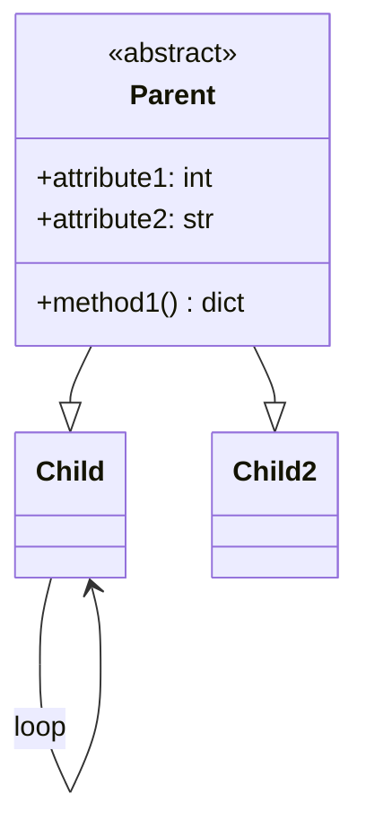

---
title: Example
---

```mermaid

classDiagram
		class Parent{
			<<abstract>>
			+attribute1: int
			+attribute2: str
			+method1() dict
		}

		class Child {

		}

Parent --|> Child
Parent --|> Child2
Child --> Child: loop

```
