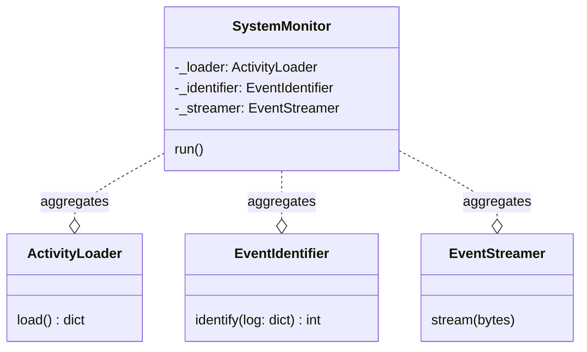
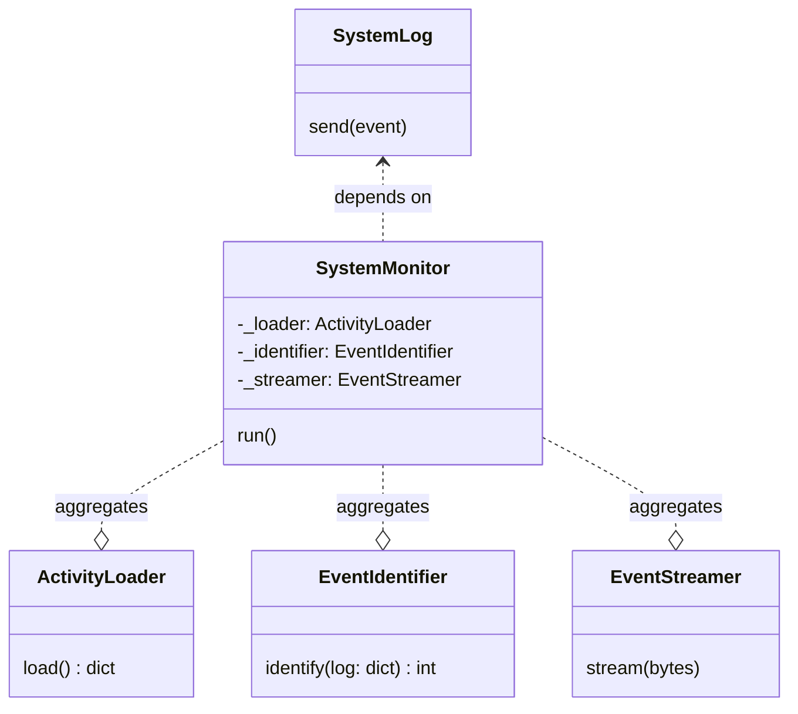
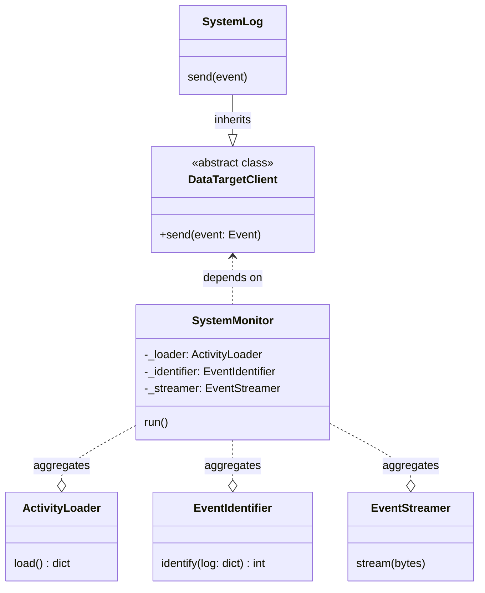
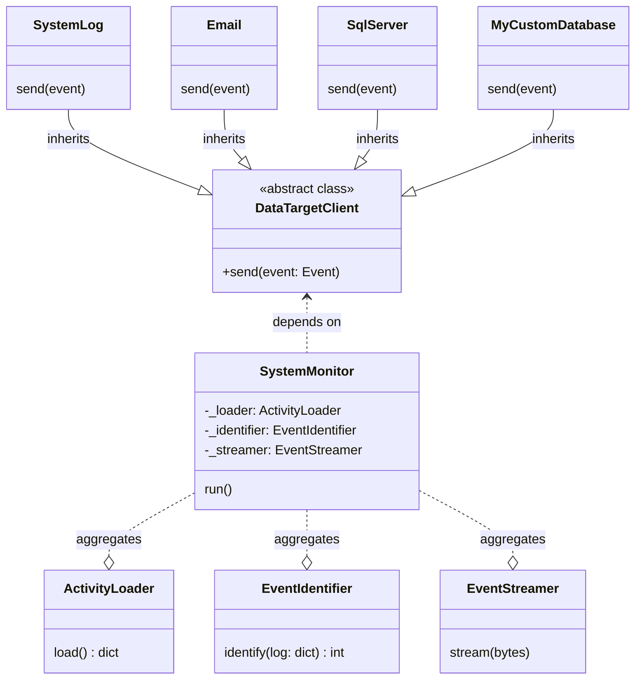

---
DIP: Same example from SRP
---

---
DIP: Bad example
---

Add a dependency to a concrete implementation
(the ExternalActor class).

---
DIP: Good example
---
Invert the dependency and make both
SystemMonitor & SystemLog to depend on an abstract class.

---
DIP:Good example
---

