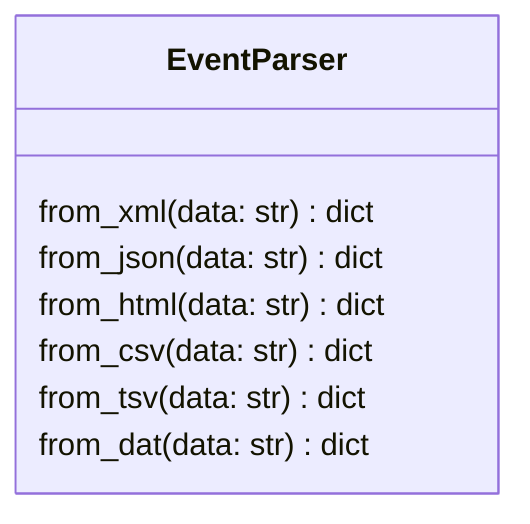
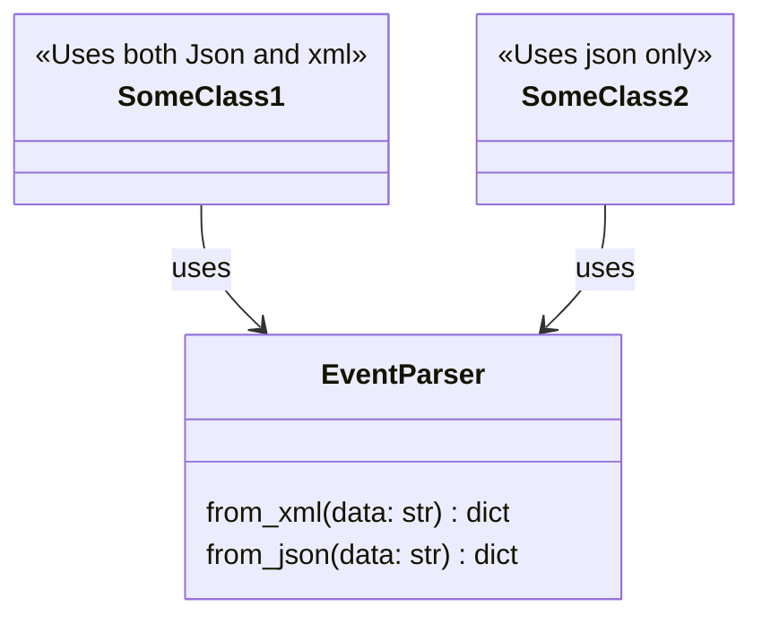
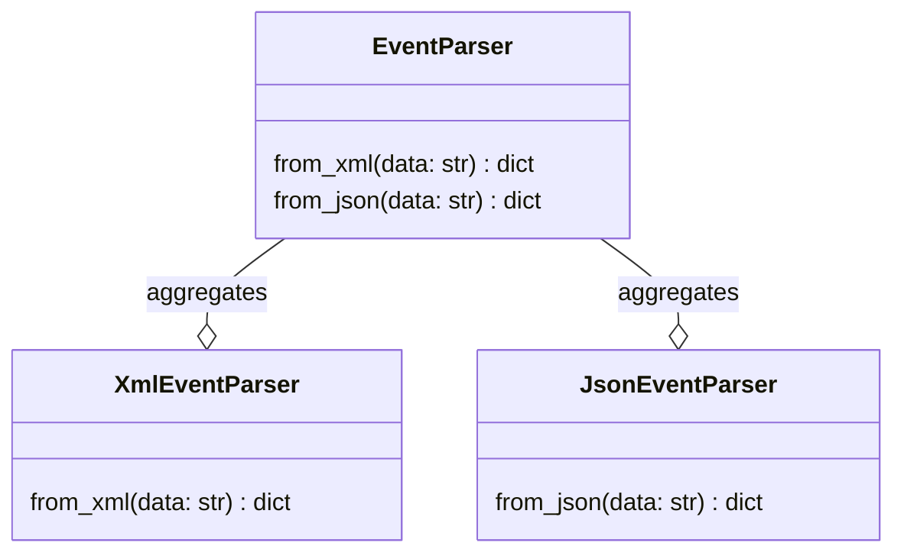
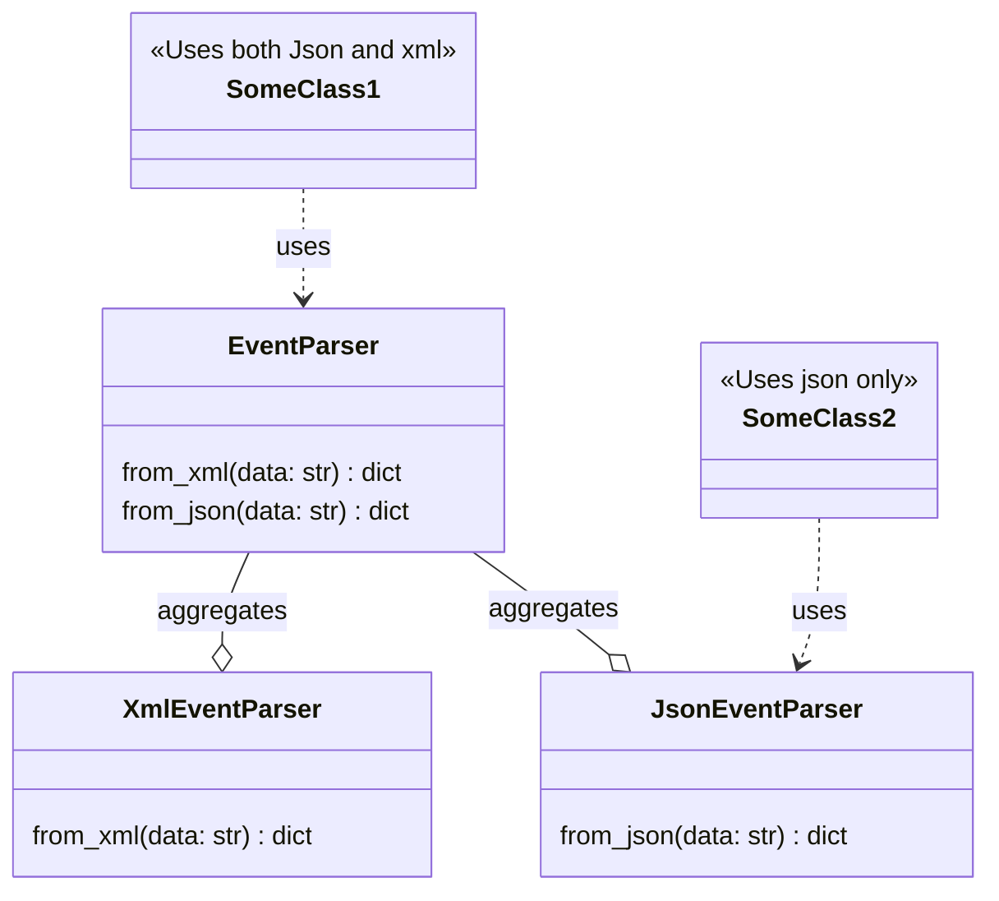

---
ISP: Bad example
---

---
ISP: Bad example
---
If we have "SomeClass2" that only parses json,
it makes no sense it will have access to
the "from_xml" method.
It should not be able to see it's existance.

---
ISP: Good example
---
What is if we split the EventParser class into
smaller interfaces?

---
ISP: Good example
---
Now, each "SomeClass1" and "SomeClass2" can have access
to its minimum interface that it requires!

