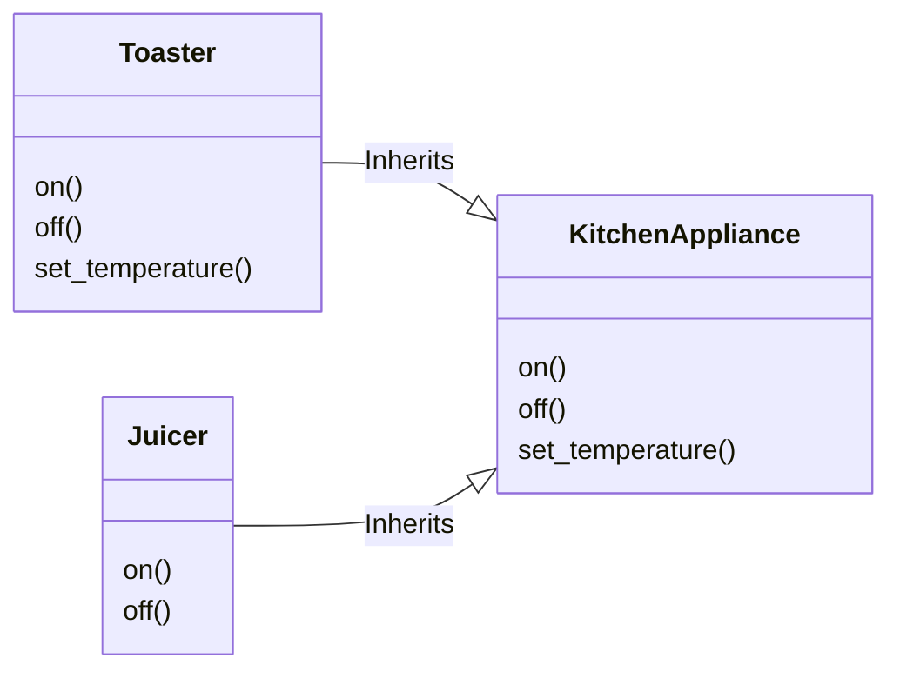

---
# [LSP] Example 0

```mermaid

classDiagram
direction RL

class KitchenAppliance {
    on()
    off()
    set_temperature()
}

class Toaster {
    on()
    off()
    set_temperature()
}


class Juicer {
    on()
    off()
}


KitchenAppliance <|-- Toaster: Inherits
KitchenAppliance <|-- Juicer: Inherits
```
