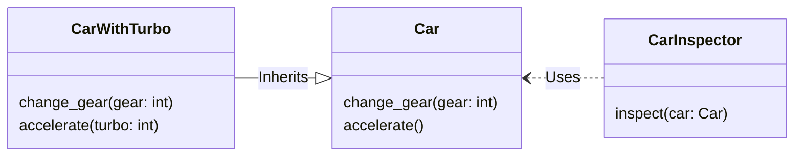

---
# [LSP] Example 1

```mermaid

classDiagram
direction RL

class Car {
    change_gear(gear: int)
    accelerate()
}

class CarWithTurbo {
    change_gear(gear: int)
    accelerate(turbo: int)

}

class CarInspector {
    inspect(car: Car)
}

Car <|-- CarWithTurbo : Inherits
CarInspector ..> Car: Uses
```
