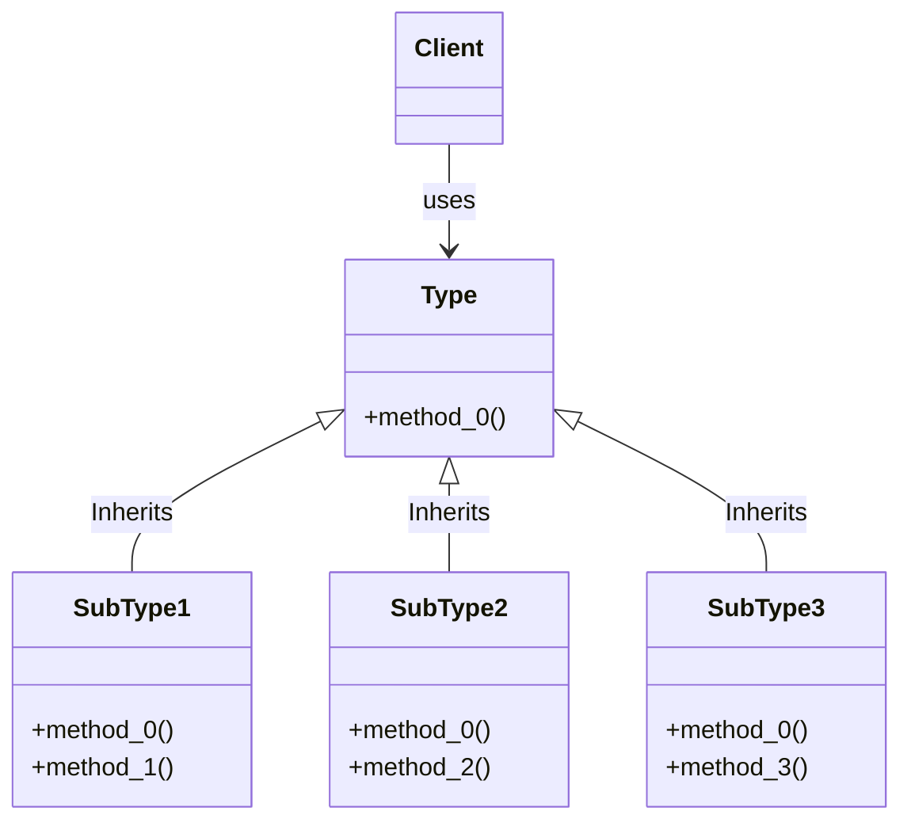
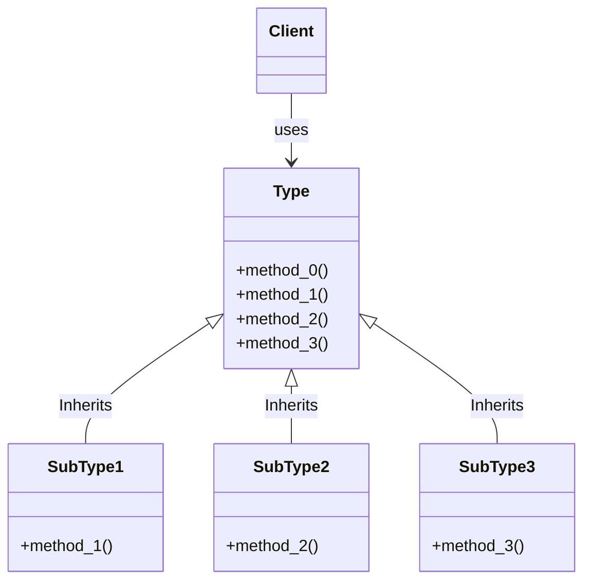
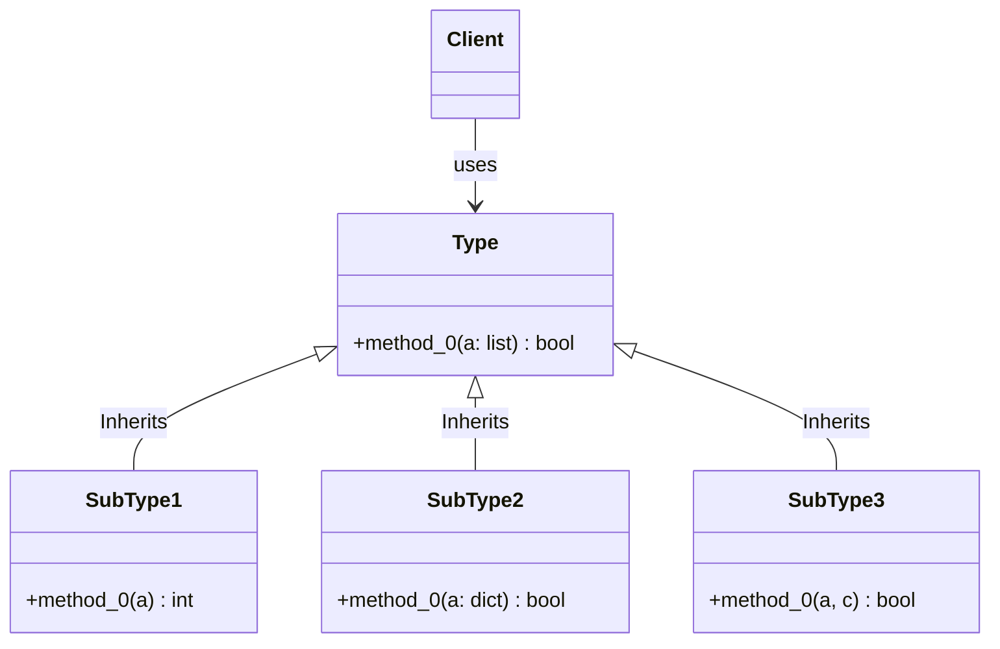

---
Follows LSP
---
Sub-classes extends super-class.
All sub-classes have the same method of the super-class,
and they can take place of the super-class.

---
Violates LSP
---
None of the sub-classes can take place of the super-class.
This kind of design tells you your abstraction is wrong.

---
Violates LSP (example 2)
---
All sub-classes have the same method,
but have different arguments and returns.
This also violates LSP as sub-classes
can't take place of the super-class.

