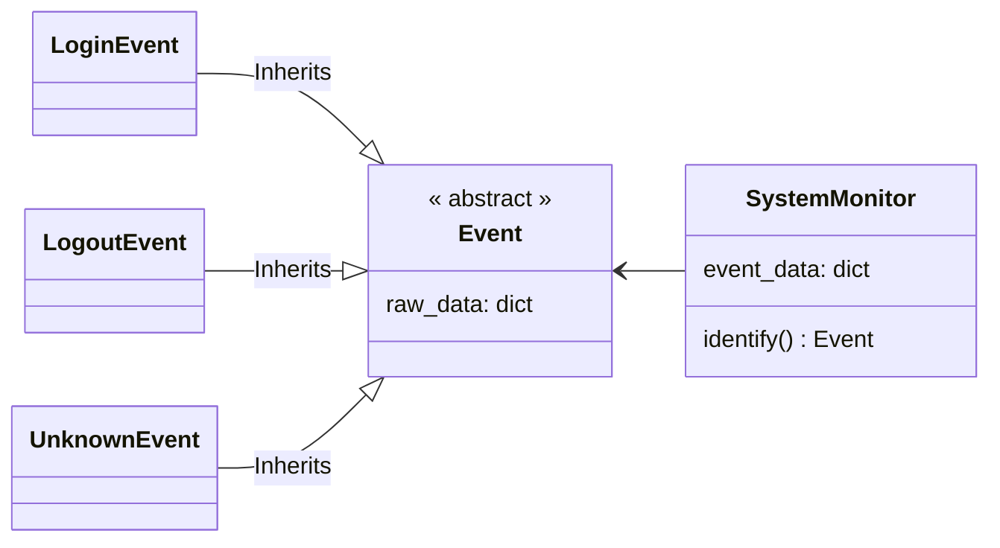

---
OCP: Bad example
---

```mermaid

classDiagram
direction RL

class Event {
    << abstract >>
    raw_data: dict
}

class LoginEvent
class LogoutEvent
class UnknownEvent


class SystemMonitor {
    event_data: dict
    identify() Event

}


Event <|-- LoginEvent : Inherits
Event <|-- LogoutEvent: Inherits
Event <|-- UnknownEvent: Inherits

SystemMonitor --> Event
```
