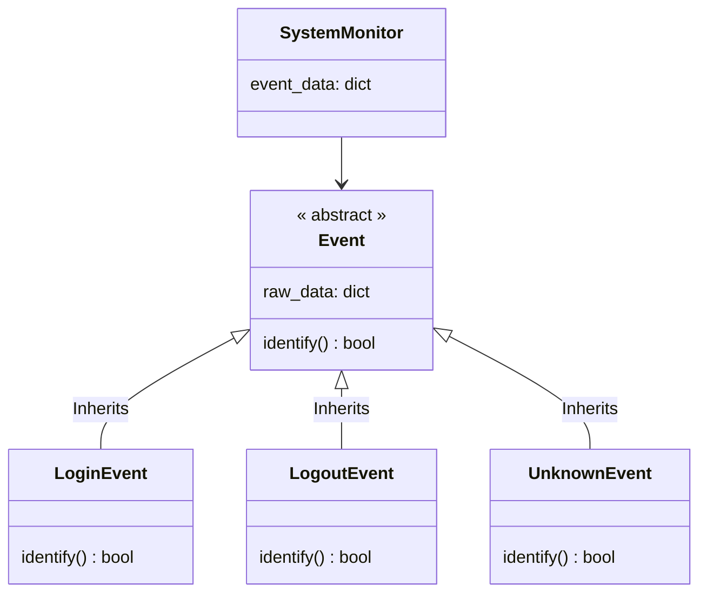

---
OCP: Good example
---

```mermaid

classDiagram
direction TB

class Event {
    << abstract >>
    raw_data: dict
    identify() bool
}

class LoginEvent {
    identify() bool
}
class LogoutEvent  {
    identify() bool
}
class UnknownEvent  {
    identify() bool
}


class SystemMonitor {
    event_data: dict
}


Event <|-- LoginEvent : Inherits
Event <|-- LogoutEvent: Inherits
Event <|-- UnknownEvent: Inherits

SystemMonitor --> Event
```
