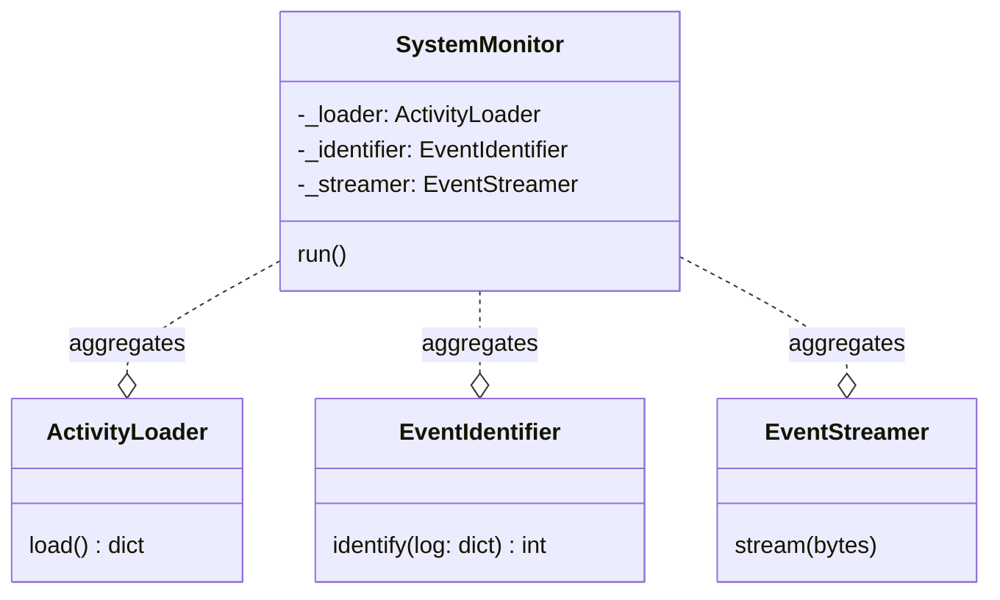

---
title: Example
---

```mermaid

classDiagram
class ActivityLoader {
	load() dict
}
class EventIdentifier {
	identify(log: dict) int
}
class EventStreamer {
	stream(bytes)
}
class SystemMonitor {
	-_loader: ActivityLoader
	-_identifier: EventIdentifier
	-_streamer: EventStreamer
	run()
}


SystemMonitor ..o ActivityLoader: aggregates
SystemMonitor ..o EventIdentifier: aggregates
SystemMonitor ..o EventStreamer: aggregates

```
